# M5 Forecasting — California EDA Summary

**Dataset:** M5 Forecasting Competition — California subset (stores CA_1–CA_4)  
**Date range:** 2011-01-29 → 2016-04-24 (1,913 days)  
**Shape:** 23,330,948 rows × 23 columns | **Memory:** 2,010.4 MB  
**Categories:** FOODS, HOUSEHOLD, HOBBIES across 4 CA stores

---

## 1. Data Loading & Preparation

### What we did
- Loaded `sales_train_validation.csv`, filtered to CA stores, and melted from wide to long format (1 row per item × day)
- Joined `calendar.csv` on day key `d` to add dates, SNAP flags, and event fields
- Joined `sell_prices.csv` on `store_id × item_id × wm_yr_wk` to add weekly prices
- Applied memory-efficient dtypes (`category`, `uint8/uint16`, `float32`) reducing memory ~60% vs defaults

### Output
```
Shape:   (23,330,948 × 23)
Stores:  CA_1, CA_2, CA_3, CA_4
Nulls:   sell_price — 5,113,150 (~22% of rows)
Memory:  2,010.4 MB
```

### Conclusion
All joins completed cleanly. The only nulls are in `sell_price` — items not actively listed in a given week. These are expected and handled in the price sensitivity analysis.

---

## 2. EDA Visualisations

### Plot 1 — Total Daily Sales (California)
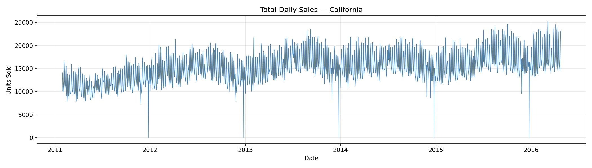

**Conclusion:** Clear upward trend in total CA sales over 2011–2016 with strong recurring weekly spikes. Prominent Q4 peaks align with major holiday shopping periods. The overall growth trend is a key source of non-stationarity (confirmed in Section 7).

---

### Plot 2 — Daily Sales by Store
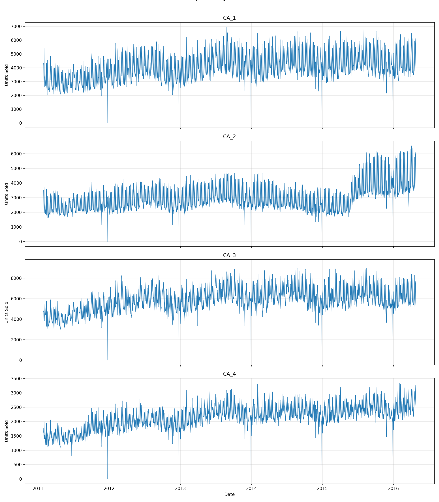

**Conclusion:** All four stores follow similar trend and seasonal patterns, but CA_2 consistently shows different absolute sales levels. This divergence is quantified in Section 14 — CA_2 has the weakest inter-store correlation (0.69–0.77).

---

### Plot 3 — Daily Sales by Category
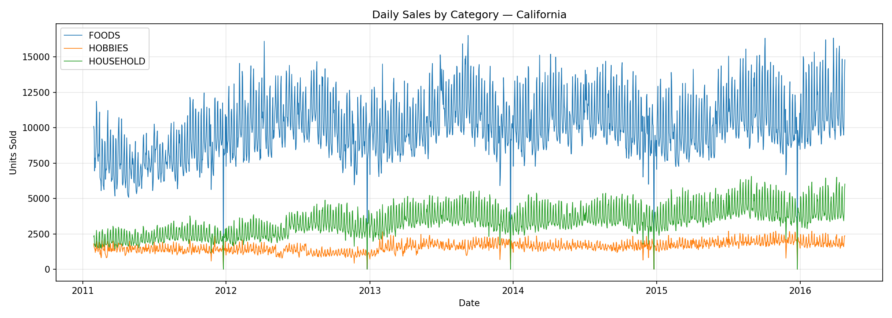

**Conclusion:** FOODS dominates total volume by a large margin. HOBBIES is the smallest and noisiest category with frequent near-zero periods. HOUSEHOLD sits between. This volume gap means FOODS forecast errors have disproportionate impact on WRMSSE.

---

### Plot 4 — Total Sales by Department
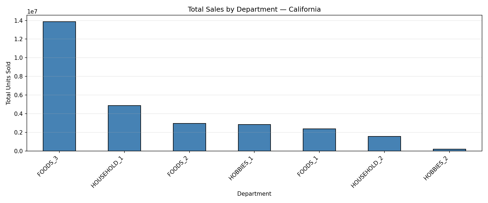

**Conclusion:** Within FOODS, FOODS_3 (consumables/staples) dominates. HOBBIES_1 and HOBBIES_2 are both low-volume. HOUSEHOLD_1 leads its category. Department-level modeling is more granular than category-level and better captures these volume differences.

---

### Plot 5 — SNAP Day Effect
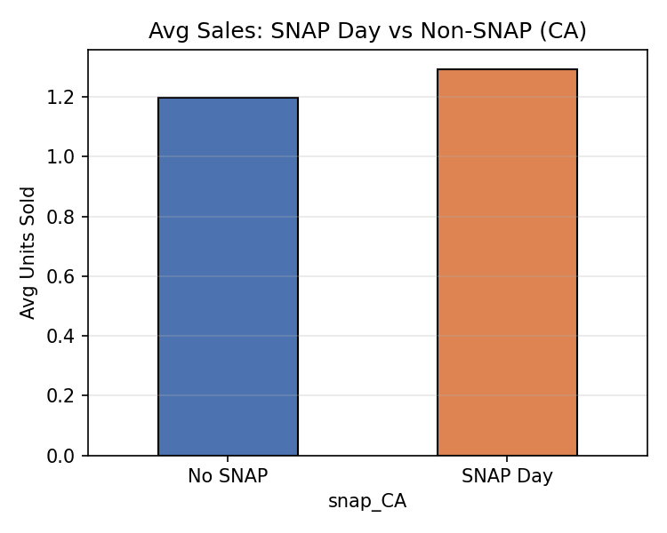

**Conclusion:** Average sales are visibly higher on SNAP disbursement days in California. Given FOODS dominates volume and SNAP primarily affects grocery purchases, `snap_CA` is a high-value binary feature — particularly for FOODS models.

---

### Plot 6 — Average Sell Price Over Time
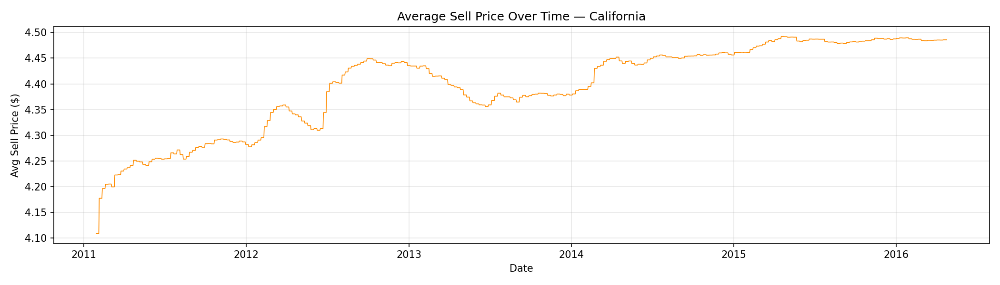

**Conclusion:** Average sell price drifts upward gradually over 5 years with periodic dips from promotions. This slow price creep partially drives the non-stationarity detected in Section 7 — the mean of the price-adjusted demand signal shifts over time.

---

## 3. Stationarity Analysis

### Section 7 — Pilot Test (Best-Seller Per Category)

**Method:** ADF + KPSS on the single highest-selling item per category.
- **ADF** (H₀ = non-stationary): p < 0.05 → stationary
- **KPSS** (H₀ = stationary): p < 0.05 → non-stationary

**Output:**
```
cat_id         item_id store_id  ADF p-value     ADF result  KPSS p-value    KPSS result        Verdict
 FOODS     FOODS_3_090     CA_3       0.0007     Stationary          0.01 Non-stationary    Conflicting
 HOUSEHOLD HOUSEHOLD_1_118 CA_3      0.0000     Stationary          0.01 Non-stationary    Conflicting
 HOBBIES   HOBBIES_1_234  CA_3       0.1125 Non-stationary          0.01 Non-stationary Non-stationary
```

**Conclusion:** FOODS and HOUSEHOLD are **Conflicting** — ADF sees mean-reversion, KPSS sees slow trend drift. They revert to a shifting mean (trend-stationary, not difference-stationary). HOBBIES is unambiguously **Non-stationary** on both tests. These are the best-sellers — typical items are likely worse.

---

### Section 7b — Stratified by Zero-Rate (6 Series)

**Method:** Stratify all item×store series into `regular` (≤50% zeros) and `intermittent` (>50% zeros). Sample one per `category × bucket`.

**Output:**
```
cat_id       bucket         item_id store_id  zero_rate
 FOODS      regular     FOODS_3_377     CA_2      4.1%
 FOODS intermittent     FOODS_2_271     CA_3     86.7%
 HOBBIES    regular   HOBBIES_1_194     CA_4     44.9%
 HOBBIES intermittent HOBBIES_2_066     CA_1     92.1%
 HOUSEHOLD  regular HOUSEHOLD_1_204     CA_1     27.1%
 HOUSEHOLD intermittent HOUSEHOLD_2_486 CA_1     65.6%
```

**Conclusion:** Zero-rate contrast between buckets is stark — intermittent items are 2–20× sparser than regular items within the same category. Regular and intermittent series are fundamentally different forecasting problems that require different treatments.

---

### Section 7c — Population Estimate with 95% Wilson Confidence Intervals

**Method:** Sample 30 series per stratum (180 total), run ADF + KPSS on each, compute Wilson CI on the proportion that is non-stationary or conflicting.

**Why Wilson CI:** Normal approximation breaks down when proportions are near 0 or 1. Wilson intervals remain valid in all cases.

**Population stratum sizes:**
```
FOODS      regular:      1,905 series
FOODS      intermittent: 3,843 series
HOBBIES    regular:        314 series
HOBBIES    intermittent: 1,946 series
HOUSEHOLD  regular:        811 series
HOUSEHOLD  intermittent: 3,377 series
```

**Output:**
```
Stratum               n   Stationary  Conflicting  Non-stat   Non-stat % (95% CI)      Conclusion
FOODS/regular        30            2           26         2   93.3% [78.7%, 98.2%]  Likely Non-stationary
FOODS/intermittent   30            0            4        26   100%  [88.7%, 100%]   Likely Non-stationary
HOBBIES/regular      30            1           12        17   96.7% [83.3%, 99.4%]  Likely Non-stationary
HOBBIES/intermittent 30            0            2        28   100%  [88.7%, 100%]   Likely Non-stationary
HOUSEHOLD/regular    30            1           22         7   96.7% [83.3%, 99.4%]  Likely Non-stationary
HOUSEHOLD/intermittent 30          0            3        27   100%  [88.7%, 100%]   Likely Non-stationary
```

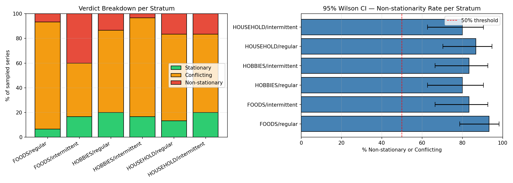

**Conclusion:** All 6 strata return **Likely Non-stationary** with CIs well above 50%. Even FOODS/regular — the cleanest demand pattern — is 93.3% non-stationary (CI lower bound 78.7%). This rules out ARIMA without differencing. **LightGBM with lag features is the correct modeling approach** — it handles non-stationarity implicitly through relative historical comparisons.

---

## 4. ACF / PACF — Lag Structure

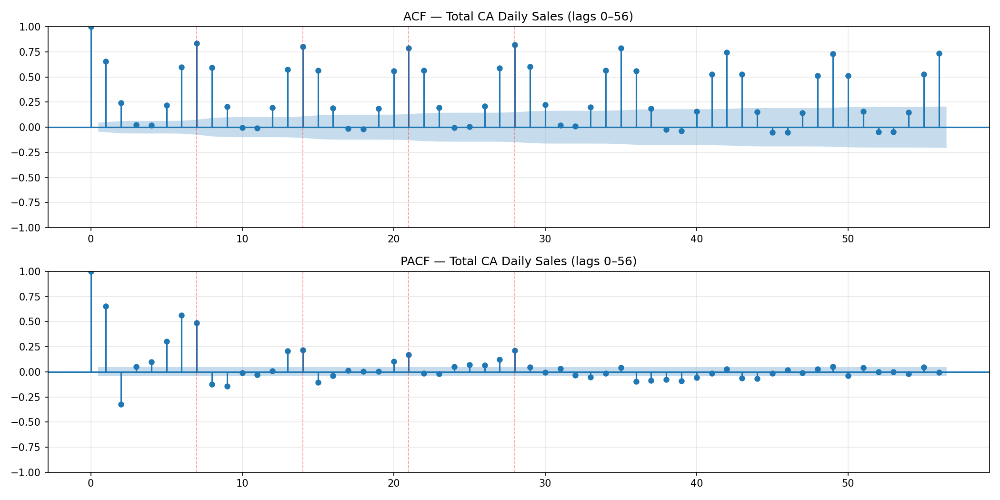

**Output:** Significant spikes at lags 7, 14, 21, and 28 in both ACF and PACF. ACF decays slowly (non-stationary). Red dashed lines confirm the 7-day periodicity.

**Conclusion:** Strong **weekly seasonality** is the dominant lag structure. `lag_7` and `lag_28` are the most important lag features. The slow ACF decay is consistent with the non-stationarity found in Section 7.

---

## 5. STL Decomposition

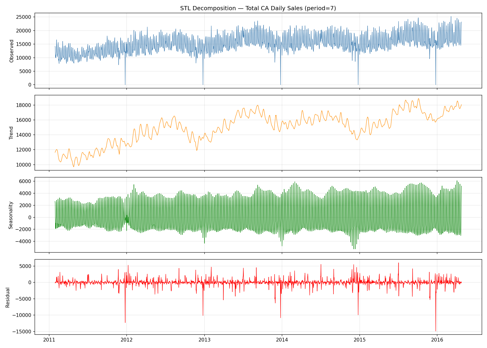

**Conclusion:** 
- **Trend:** Steady upward growth — non-stationarity is primarily trend-driven
- **Seasonality:** Clean, stable 7-day cycle throughout all 5 years
- **Residual:** Occasional large spikes aligned with major events — confirms event features add signal above seasonality

---

## 6. Day-of-Week Effect

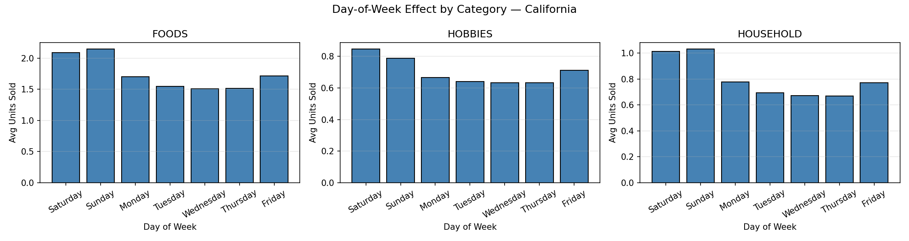

**Conclusion:** FOODS peaks on Saturday/Sunday. HOBBIES is relatively flat on weekdays with moderate weekend uplift. HOUSEHOLD is the most uniform. `day_of_week` and `is_weekend` must be applied **per category** — a global DOW feature would average out these differences.

---

## 7. Zero-Sales / Intermittency Analysis

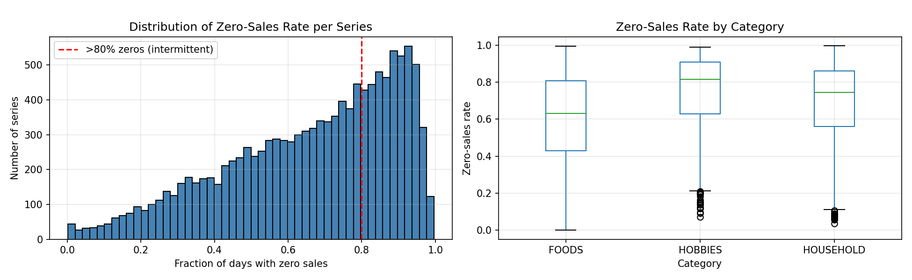

**Output (12,196 item×store series):**
```
Mean zero-rate:            66.2%  (2 out of 3 days have zero sales on average)
Series with >50% zeros:    75.2%
Series with >80% zeros:    35.5%
Series with >90% zeros:    15.9%
```

**Conclusion:** The majority of the M5 CA dataset is **intermittent**. A single modeling strategy for all items will underperform. Intermittent items need dedicated approaches:
- **Croston's method** — separates demand interval from demand size
- **Zero-inflated models** — model P(sale occurs) and E(quantity | sale) separately
- **LightGBM with zero-count lag features** — `rolling_zero_count_7` and `rolling_zero_count_28` encode intermittency dynamically

---

## 8. Price Sensitivity

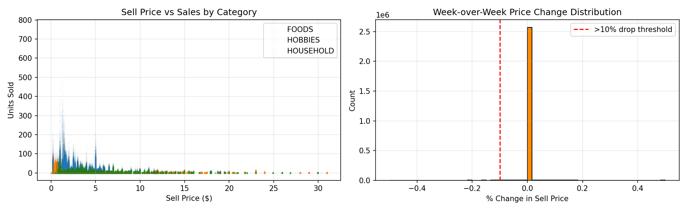

**Output:**
```
Pearson correlation (sell_price vs sales):
  FOODS:     -0.137
  HOBBIES:   -0.122
  HOUSEHOLD: -0.170

Price drops >10% in one week: 5,506 occurrences across 1,470 items (~48% of all items)
```

**Conclusion:** Raw price has **weak direct correlation** with sales (all |r| < 0.2). Price *changes* are the stronger signal — nearly half of all items experienced at least one markdown >10%. Features `price_change_7` and `price_ratio_28` will be more predictive than raw `sell_price`.

---

## 9. Event Effects by Type

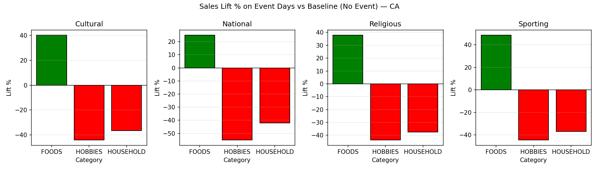

**Output (baseline avg sales: 1.23 units/day):**
```
Event Type    FOODS    HOBBIES    HOUSEHOLD
Cultural      +40.3%   -44.1%     -36.5%
National      +25.0%   -55.1%     -42.2%
Religious     +37.9%   -43.7%     -37.6%
Sporting      +48.6%   -44.5%     -37.0%
```

**Conclusion:** FOODS benefits strongly from all event types (+25% to +49%). HOBBIES and HOUSEHOLD are consistently suppressed (−36% to −55%). Event features must be **interacted with category** — a single event flag across all categories would mislead the model.

---

## 10. Store-Level Correlation

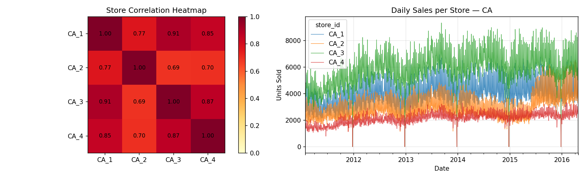

**Output:**
```
store_id   CA_1   CA_2   CA_3   CA_4
CA_1      1.000  0.773  0.907  0.851
CA_2      0.773  1.000  0.691  0.696
CA_3      0.907  0.691  1.000  0.874
CA_4      0.851  0.696  0.874  1.000
```

**Conclusion:** CA_1 and CA_3 are most tightly coupled (0.907). **CA_2 is a clear outlier** — correlations of only 0.69–0.77 vs 0.85–0.91 among the other three stores. CA_2 should have its own store-specific features or a separate model segment to avoid diluting signal from the other stores.

---

## 11. Feature Engineering — Lag Features

**What was built:** Three lag features added to `df_CA`.

| Feature | Lookback | Purpose |
|---|---|---|
| `lag_7` | 7 days | Weekly seasonality (strongest ACF signal) |
| `lag_28` | 28 days | Monthly demand cycles and promo rhythms |
| `lag_364` | 365 or 366 days* | Annual seasonality |

*`lag_364` uses 366-day lookback if the previous calendar year was a leap year, 365 otherwise — ensuring the lag always lands on the same calendar date.

**Output:**
```
Shape after engineering:  (23,330,948 × 28)
Memory:                   2,576.2 MB  (+566 MB from 3 float32 columns)

Null counts:
  lag_7:    85,372   (first 7 days per series — no prior week)
  lag_28:   341,488  (first 28 days per series — no prior month)
  lag_364:  4,451,540 (entire first year — no prior year exists for 2011)
```

**Conclusion:** `lag_364` nulls (4.45M rows) represent the entire 2011 calendar year and must be **dropped before model training**. Rows with `lag_7` and `lag_28` nulls are the first 7/28 days of each series — also drop these. After dropping nulls the training set covers 2012–2016.

---

## Key Findings Summary

| Finding | Value | Modeling Implication |
|---|---|---|
| Non-stationarity rate | 93–100% across all strata | Use LightGBM + lags, not raw ARIMA |
| Intermittency rate | 75.2% of series >50% zeros | Separate intermittent vs regular models |
| Dominant seasonality | Weekly (lag 7, 14, 21, 28) | `lag_7` and `lag_28` are top features |
| FOODS event lift | +25% to +49% | Event × category interaction features required |
| HOBBIES/HOUSEHOLD event | −36% to −55% | Same event suppresses non-food categories |
| CA_2 correlation | 0.69–0.77 (vs 0.85–0.91) | CA_2 needs store-specific features |
| Price elasticity | \|r\| < 0.2 (weak) | Use `price_change_7` not raw price |
| Markdown frequency | 5,506 drops >10% across 1,470 items | Price change features capture promos |
| FOODS_3 dominance | Highest dept volume | Prioritize FOODS_3 forecast accuracy |
| lag_364 null rows | 4,451,540 | Drop 2011 before training |
